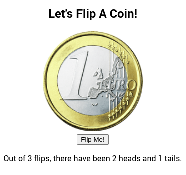

# Flip a coin

This is a program where you flip a coin.  
You can find a [demo here](https://flip-my-coin.netlify.app/).

<cener>

Once you download the repository, in order to run the program you must follow these steps:
1) `cd roll-the-dice`
2) `npm install`
3) `npm start` 

**Notice**: You must have [nodejs](https://nodejs.org/) installed.
