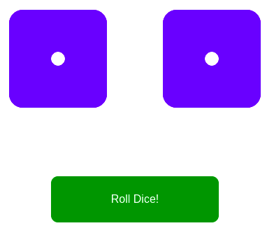

# Roll the dice

This is a program where you roll randomly 2 dices. Might be useful for playing backgammon or other board game.

<cener>

Once you download the repository, in order to run the program you must follow these steps:
1) `cd roll-the-dice`
2) `npm install`
3) `npm start` 

**Notice**: You must have [nodejs](https://nodejs.org/) installed.
